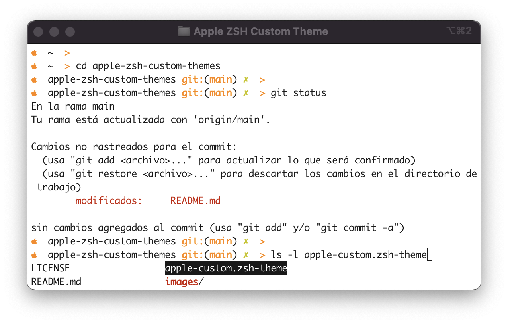
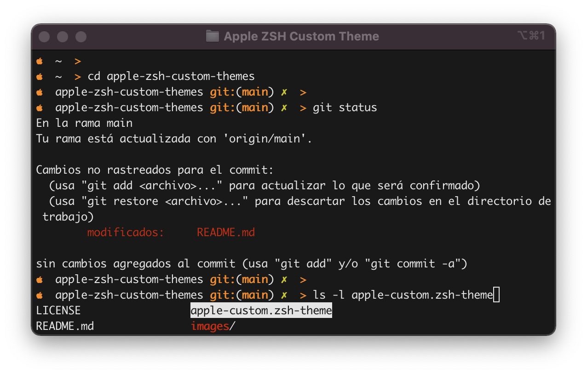

# Apple ZSH Custom Themes
dads


## Installation

This theme is based on the default `bobbyrussell`, but applies some changes. I have added variables to set colors by modifying only var code. By default I use **orange** color.

Copy custom theme file to zsh custom themes path:
```sh
cp apple-custom.zsh-theme $ZSH/custom/themes/
```

Modify your `.zshrc` profile to add the custom theme variable:
```sh
# Set name of the theme to load --- if set to "random", it will
# load a random theme each time oh-my-zsh is loaded, in which case,
# to know which specific one was loaded, run: echo $RANDOM_THEME
# See https://github.com/ohmyzsh/ohmyzsh/wiki/Themes
ZSH_THEME="apple-custom"
```

Then, restart your zsh session to apply the changes or reload the zsh profile:
```sh
. ./.zshrc
```

### Screenshots



## License
MIT License

See [LICENSE](https://github.com/aramirol/apple-zsh-custom-themes/blob/main/LICENSE) to see the full text.

